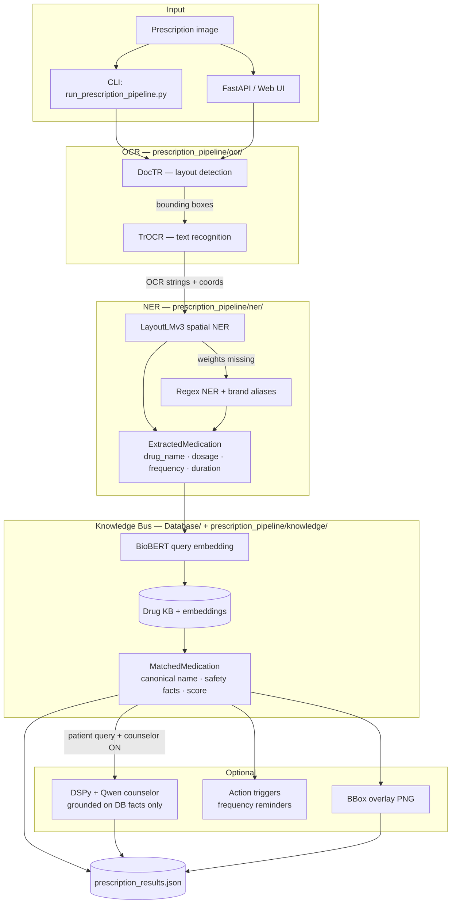

# rx-ocr-counselor

End-to-end prescription OCR pipeline: extract medications from Rx images, match them to a drug knowledge base, and optionally answer patient questions with a grounded LLM counselor.

**Stack:** DocTR → TrOCR → LayoutLMv3 NER (regex fallback) → BioBERT KB → optional DSPy (Qwen 2.5)

---

## What It Does

| Stage | Module | Output |
|-------|--------|--------|
| Layout detection | DocTR | Text region bounding boxes |
| Text recognition | TrOCR | OCR strings per box |
| Entity extraction | Regex NER / LayoutLMv3 | `drug_name`, dosage, frequency, duration |
| Knowledge lookup | BioBERT + `Database/` | Canonical drug, safety facts, match score |
| Patient Q&A (optional) | DSPy + local Qwen | Grounded counseling from DB facts only |

## Pipeline Flow



Target medication schema (Phase 1.1):

```json
{
  "drug_name": "amoxycillin",
  "dosage": "500mg",
  "frequency": "TDS",
  "duration": "5 days"
}
```

---

## Phase Status

| Phase | Goal | Status |
|-------|------|--------|
| 1 | Schema + KB + workspace | Done — JSON schema, `Database/mid_clean.json`, embeddings |
| 2 | DocTR + TrOCR OCR stack | Done — wired in `prescription_pipeline/ocr/` |
| 3 | LayoutLMv3 spatial NER | Partial — engine wired; fine-tuned weights still needed |
| 4 | BioBERT knowledge bus | Done — `Database/drug_matcher.py`, alias map, KB gate |
| 5 | DSPy counselor | Partial — engine wired; BootstrapFewShot compile pending on GPU |
| 6 | Deployment + UI | Partial — hosted web UI + FastAPI; Butterfly optional |

---

## Quick Start

### 1. Install

```bash
pip install -r requirements.txt
```

Pin compatible deps if you hit `numpy` / `sklearn` errors (`numpy>=1.26.4,<2.4`, `scikit-learn>=1.5.2`).

### 2. Download models

```bash
python pipeline_models/download_models.py trocr-base-handwritten
python pipeline_models/download_models.py biobert-base-cased-v1.1
python pipeline_models/download_models.py layoutlmv3-base
python pipeline_models/download_models.py qwen2.5-0.5b-instruct   # counselor (optional)
```

Rebuild KB embeddings if missing:

```bash
python Database/build_embeddings.py
```

### 3. Run CLI

```bash
python run_prescription_pipeline.py page_image/sample_rx.png -o output
python run_prescription_pipeline.py sample_rx_test.png -o output
```

With counseling:

```bash
python run_prescription_pipeline.py page_image/sample_rx.png -o output \
  --patient-query "Can I take this with food?" \
  --counselor-model qwen2.5-0.5b-instruct
```

Results: `output/prescription_results.json` and `output/overlays/`.

---

## Hosted UI (upload + chat)

Start the API and built-in web UI:

```bash
uvicorn deployment.api_server:app --host 0.0.0.0 --port 8000
```

Open **http://localhost:8000**

1. Upload prescription image → **Extract medications** (OCR + NER + DB only, no LLM)
2. Toggle **Need Counselor** ON → ask questions in chat (DSPy + local Qwen)

Counselor runs only when the toggle is ON. DB facts are always shown from the knowledge base.

Docker:

```bash
docker compose up --build
```

---

## Project Layout

```
prescription_pipeline/   # Production pipeline (OCR, NER, KB, counseling)
deployment/              # FastAPI server + static web UI
Database/                # Drug KB, embeddings, drug_matcher
pipeline_models/         # Local model weights + download script
page_image/              # Sample prescriptions
output/                  # JSON results + bbox overlays
```

---

## Known Limitations

Regex NER is active until `pipeline_models/layoutlmv3-rx-ner/` is fine-tuned. Current pain points:

- OCR misreads (`Amox` → `Amor`) — mitigated by brand aliases; TrOCR fine-tune still needed
- Complex hospital templates (`2nPPipXy.jpg`) — section headers, fragmented lines
- Combo strengths (e.g. Augmentin 625) — may match as `ambiguous` in KB
- CPU counseling is slow — use `qwen2.5-0.5b-instruct` or GPU

---

## Critical Rules

- **Never trust OCR spelling alone** — always run BioBERT KB match on confirmed entities
- **LLM only synthesizes DB facts** — counselor must not invent medical advice
- **Recompile DSPy, don't hand-edit prompts** — add failed examples and run `prescription_pipeline.counseling.compile`
